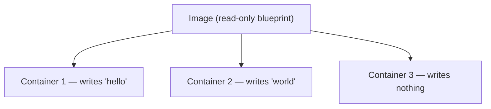
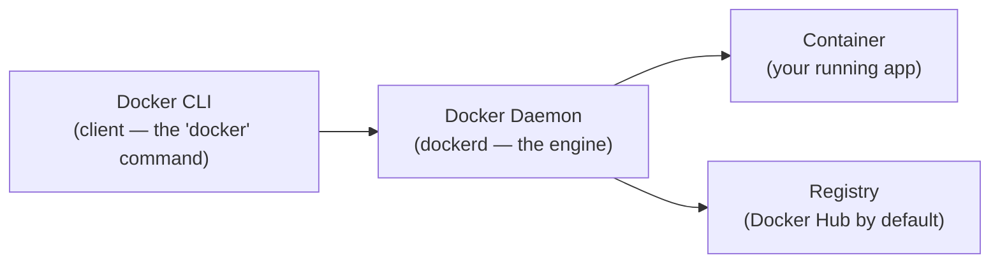

## The call you don't want

Picture it: you're at a café, laptop open, second coffee in. You just shipped the feature that's been eating your week. It runs beautifully — on your machine. Tests green, app humming, you close the lid feeling like a wizard.

Then your phone buzzes. It's down in production. "It's throwing errors, nothing loads."

And you say the sentence every developer has said at least once, usually while quietly panicking:

> "…but it works on my machine?"

That sentence is the whole reason Docker exists. So before we touch a single command, let's sit with *why* your machine and the production server so casually betray each other — because once you feel that pain clearly, everything Docker does starts to look obvious.

## Why your laptop and prod disagree

Your laptop and the server are running the "same" app, but they are not the same *environment*. They almost never are. Here's a fairly typical mismatch:

| Factor | Your Mac | Production server |
|---|---|---|
| OS | macOS | Ubuntu 22.04 |
| Node version | v23.x | v18.x |
| PostgreSQL | 17 | 14 |
| File paths | `/Users/raunak/...` | `/var/app/...` |
| Installed tools | GUI, Spotlight, Chrome | CLI only |

Any one of these rows can be the thing that takes you down at 11pm. A different Node version drops a feature your code assumed. A Postgres major version behaves differently on some edge query. A path that exists on your Mac just… doesn't, over there.

This is the **"works on my machine" problem**, and it's less a bug than a category of bug — the environment itself is the variable, and nobody's version-controlling the environment.

### We did try to fix this before

Docker wasn't the first attempt at making environments match. It's just the one that stuck. The earlier options each solved a piece and left a mess somewhere else:

| Approach | The catch |
|---|---|
| Virtual machines | Heavy (gigabytes), slow to boot, wasteful with resources |
| Setup documentation | Always out of date, never followed exactly |
| Config management (Chef, Puppet) | Powerful, but complex to maintain, and it drifts over time |
| "It works on my machine" | Not a solution — just hope with extra steps |

The insight Docker leans on is small and kind of beautiful: instead of *describing* the environment and praying everyone reproduces it, make **the environment itself a version-controlled artifact.** Ship the environment along with the code. Now "my machine" and "the server" aren't reproductions of each other — they're literally running the same packaged thing.

> A quick, honest note before we go further: this is Part 1 of a series, and it's deliberately the "what and why" part. A proper *history* of Docker — the dates, the company, what came before it at the OS level — is a story I'm saving for its own post, partly because I want to get it right rather than hand-wave it here.

## So what actually is Docker?

Docker is a platform for packaging an application into a **standardized, self-contained unit called a container.** A container bundles everything the app needs to run: the code, the runtime, system tools, libraries, and settings. The pitch is that it then runs identically everywhere — your laptop, a test box, production, the cloud.

If you want the one-sentence version to give a non-technical friend:

> Docker is like a shipping container for software. It packs your app with everything it needs, so it behaves the same wherever you put it.

That's the promise. The rest of this post is really just two ideas that make the promise concrete: **images vs containers**, and the **architecture** that runs them.

## Images vs containers (the one distinction to actually get)

If you've done any object-oriented programming, you already have the mental model. Steal it directly:

| Idea | OOP | Docker |
|---|---|---|
| Blueprint | Class | **Image** |
| Running instance | Object | **Container** |

- An **image** is a read-only snapshot of a filesystem plus some metadata. A frozen blueprint. It doesn't *run* — it's the recipe and the ingredients, sealed.
- A **container** is that image, plus a thin writable layer, plus a running process. The living thing.

The part that trips people up: one image can spawn *many* containers, and they don't interfere with each other.



The image never changes. Each container gets its own private writable layer on top. So container 1 scribbling "hello" into a file is invisible to container 2, and invisible to the image.

Here's the insight that makes it click: delete all three containers, spin up a fourth, and it starts *fresh* from the image — clean slate, none of the previous scribbles. Changes inside a container never leak back into the image or into its siblings. That isolation is the point. It's also why "just restart it" so often works with containers: you're not repairing the old instance, you're getting a pristine one from the same blueprint.

## The architecture: who's actually doing the work

When you type `docker run something`, it feels like one program. It isn't. Docker follows a **client–server model**, and knowing the four pieces makes every weird moment later ("why is my `docker` command hanging?") much less mysterious.



1. **Docker CLI** — the `docker` command you type. It's just the interface; it doesn't do the heavy lifting.
2. **Docker Daemon** (`dockerd`) — a background process that actually manages your images, containers, networks, and volumes. When people talk about the "Docker Engine," this daemon is the heart of it.
3. **Container** — the running instance the daemon starts for you.
4. **Registry** — where images live and get shared. Docker Hub is the default public one; teams can also run private registries for their own images.

So the flow of `docker run` is really: the CLI hands your request to the daemon, the daemon pulls the image (from the registry if it doesn't have it locally), and the daemon starts a container from it. You're the one giving orders; the daemon is the one doing the work.

> A note on where this comes from: the client–daemon–registry picture above is the standard mental model, but in my notes it's currently backed by a single overview article I haven't yet checked against the official Docker docs. It matches everything else I've learned, but treat the exact wording as "solid working understanding," not gospel — I'll tighten it as the series goes on.

## Where this shows up in TaskHub

Enough abstraction. Here's the point of anchoring this to a real project — [TaskHub](https://github.com/CodexRaunak/taskhub) — instead of a toy `hello-world`. In TaskHub, the Docker setup lives in a few files at the root:

```
taskhub/
├── Dockerfile          ← the recipe for the app's image
├── docker-compose.yml  ← how the multiple containers run together
├── .dockerignore       ← what NOT to pack into the image
└── src/                ← the actual code
```

Roughly, each file answers one question:

- **`Dockerfile`** answers *"what environment does the app need?"* — the base runtime, the dependencies, the source, the user it runs as.
- **`docker-compose.yml`** answers *"what services does the app need, and how do they run together?"* — because TaskHub isn't one process. It's an API, a database, and a cache, each in its **own** container.

Why split them into separate containers instead of cramming everything into one? Because separate containers buy you independence:

- independent **lifecycle** — restart the cache without touching the database
- independent **scaling** — run more of the busy service, not all of them
- independent **updates** — bump one without rebuilding the world
- **resource isolation** — one service misbehaving doesn't drag the others down

That's the whole "images vs containers" idea paying off in practice: one blueprint per service, many isolated running instances, orchestrated together.

> Straight-up caveat: the specific TaskHub details here — the exact services, the base image, the non-root user — come from my learning notes on the project, not from a fresh read of the repo as it stands today. The *shape* is right; if you're following along in the code, trust the repo over this paragraph, and I'll reconcile them as the series continues.

## What you've actually got now

Strip away the story and here's what's worth keeping:

- Docker exists to kill the "works on my machine" problem by making the **environment a version-controlled artifact.**
- An **image** is a read-only blueprint; a **container** is a running instance of it. One image → many isolated containers.
- Changes inside a container never touch the image or its siblings — restart gives you a clean slate.
- Docker is **client–server**: the CLI talks to the daemon, the daemon runs containers and pulls images from a registry.
- Real apps like TaskHub run as **several containers working together**, one per service, for independent lifecycle, scaling, and isolation.

That's the mental model. In the next parts we'll actually get our hands dirty — Dockerfiles and image layers, how the build cache decides your life, `.dockerignore`, and eventually Compose and networking, all on TaskHub. But you now have the thing most tutorials skip: a reason to care.

See you in Part 2.

<!-- REVIEW — remove before publishing

Drawn from Brain (B-20260717-docker-concepts-1):
- Thesis preserved verbatim in frontmatter (explain Docker pragmatically via the TaskHub project; Part 1 of a series).
- Tone directive followed: friendly, story-like (the café / prod-broke cold open, "works on my machine"), story kept as flavor and NOT allowed to overshadow the concepts — casual only in spots, as the note asked.
- Structure follows the note's Part-1 scope request: what Docker is + background + architecture. Diagrams rendered as Mermaid (see below).

Drawn from Foundry:
- F-C-docker-fundamentals — status: LIMITED-TRIANGULATION (one independence group `human-docker-learning-notes`, both source cards UNVERIFIED). Used for: the "works on my machine" problem + old-solutions tables, image-vs-container (class/object), the CLI→daemon→container/registry description, and the TaskHub section.
  Locators: raw/Docker What is Docker.md — Summary (9-12), Why Docker Exists (15-39), Image vs Container (44-67), Docker Architecture (70-93), How TaskHub Uses Docker (96-122).
- F-C-docker-architecture-overview — status: CANDIDATE (single anonymous, UNVERIFIED Medium article; independence group `medium-docker-architecture-guide`). Used only to corroborate the Engine = daemon + client framing and registry/Docker Hub description.
  Locators: raw/Docker Architecture.md — lines 19-23 (daemon/client), 25-31 (images/containers), 33-35 (registry).

Weak spots / verify before publish:
1. STATUS HONESTY: Every technical claim in this post traces to UNVERIFIED Foundry material — the fundamentals concept is `limited-triangulation` and the architecture concept is `candidate`. Nothing here has been checked against authoritative docs (docs.docker.com). Verify the image/container, client–daemon, and registry claims against official Docker docs before publishing. The two Foundry sources share NO independent corroboration (different independence groups, both unverified), so agreement between them is not proof.
2. TaskHub specifics (services api/postgres/redis, "Node 23 on Alpine", non-root user) are flagged in the Foundry ledger as project-context, LOW confidence, and NOT checked against the repo. The draft deliberately hedges this in-text, but before publishing, open github.com/CodexRaunak/taskhub and confirm the actual Dockerfile/compose services, base image, and user. Correct the draft to match the repo.
3. HISTORY GAP (requested by Brain, not in Foundry): The Brain note asked for Docker's "history + background." Foundry has ZERO historical material — no dates, no company/dotCloud origin, no LXC/cgroups/namespaces lineage. Rather than fabricate it, I reframed "background" as the problem Docker solves (honest, sourced) and added an in-text note deferring the real history to its own post. DECISION NEEDED: either (a) accept the deferral as written, or (b) capture authoritative Docker-history sources into Foundry first, then add a history section. Do not let me invent dates.
4. DIAGRAMS: The Brain note wanted flowcharts/diagrams and suggested possibly pulling images from the web/Docker docs. I did NOT fetch external images — the two diagrams in the Medium raw were miro.medium.com assets that were never captured (unverifiable), and fetching is out of scope for this skill. Instead I reproduced Foundry's two ASCII diagrams as portable ```mermaid blocks. The target site has no framework yet, so confirm your eventual site renders Mermaid (or convert these to SVG/images) before publishing.
5. Registry internals, VM-vs-container depth, security boundaries, and OCI/layer internals are intentionally NOT covered here — the evidence is thin and they belong to later parts. Don't let scope creep pull unsourced claims in.
-->
